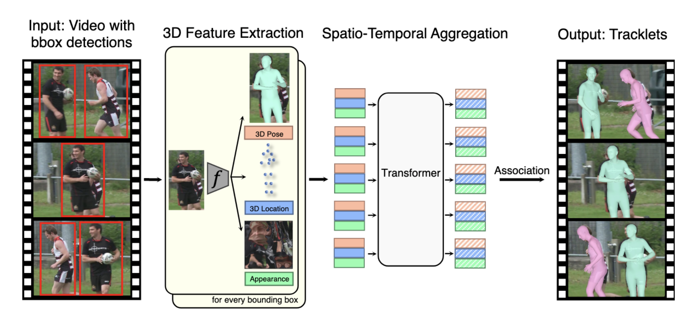
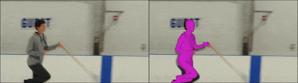
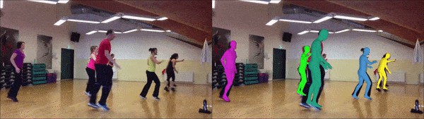
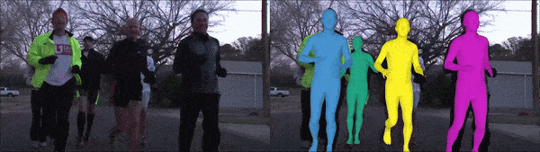
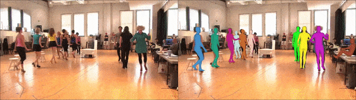
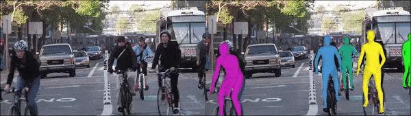

# Tracking People with 3D Representations
Code repository for the paper "Tracking People with 3D Representations" [(paper link)](https://papers.nips.cc/paper/2021/hash/c74c4bf0dad9cbae3d80faa054b7d8ca-Abstract.html) [(project site)](http://people.eecs.berkeley.edu/~jathushan/T3DP/). \
[Jathushan Rajasegaran](http://people.eecs.berkeley.edu/~jathushan/), [Georgios Pavlakos](https://geopavlakos.github.io/), [Angjoo Kanazawa](https://people.eecs.berkeley.edu/~kanazawa/), [Jitendra Malik](http://people.eecs.berkeley.edu/~malik/).\
Neural Information Processing Systems (NeurIPS), 2021.

This code repository provides a code implementation for our paper T3DP, with installation, preparing datasets, and evaluating on datasets, and a demo code to run on any youtube videos. 

<p align="center"></p>

**Abstract** : <em>We present a novel approach for tracking multiple people in video. Unlike past approaches which employ 2D representations, we focus on using 3D representations of people, located in three-dimensional space. To this end, we develop a method, Human Mesh and Appearance Recovery (HMAR) which in addition to extracting the 3D geometry of the person as a SMPL mesh, also extracts appearance as a texture map on the triangles of the mesh. This serves as a 3D representation for appearance that is robust to viewpoint and pose changes. Given a video clip, we first detect bounding boxes corresponding to people, and for each one, we extract 3D appearance, pose, and location information using HMAR. These embedding vectors are then sent to a transformer, which performs spatio-temporal aggregation of the representations over the duration of the sequence. The similarity of the resulting representations is used to solve for associations that assigns each person to a tracklet. We evaluate our approach on the Posetrack, MuPoTs and AVA datasets. We find that 3D representations are more effective than 2D representations for tracking in these settings, and we obtain state-of-the-art performance. </em> 

## Installation

We recommend creating a clean [conda](https://docs.conda.io/) environment and install all dependencies.
You can do this as follows:
```
conda env create -f _environment.yml
```

After the installation is complete you can activate the conda environment by running:
```
conda activate T3DP
```

Install PyOpenGL from this repository:
```
pip uninstall pyopengl
git clone https://github.com/mmatl/pyopengl.git
pip install ./pyopengl
```

Additionally, install [Detectron2](https://github.com/facebookresearch/detectron2) from the official repository, if you need to run demo code on a local machine. We provide detections inside the _DATA folder, so for running the tracker on posetrack or mupots, you do not need to install Detectron2.

## Download Data

We provide preprocessed files for PoseTrack and MuPoTs datasets (AVA files will be released soon!). Please download this folder and extract inside the main repository.

- [_DATA/](https://drive.google.com/file/d/1qfqkAjBWLZkZSywQz-KV_kVmeWqdm_QN/view?usp=sharing)
- [_DATA/detections](https://drive.google.com/file/d/127MZFG8tPzRK1Y4Jscawzzsnl7KC83vy/view?usp=sharing)
- [_DATA/Posetrack_2018](https://posetrack.net)
- [_DATA/MuPoTs](http://vcai.mpi-inf.mpg.de/projects/SingleShotMultiPerson/)

Besides these files, you also need to download the [neutral *SMPL* model](http://smplify.is.tue.mpg.de). Please go to the website for the corresponding project and register to get access to the downloads section. Create a folder `_DATA/models/smpl/` and place the model there. Otherwise, you can also run:

`python3 utils/convert_smpl.py`
    
## Training
To train the transformer model with posetrack data run,

`python train_t3dp.py` \
`--learning_rate 0.001`\
`--lr_decay_epochs 10000,20000`\
`--epochs 100000 `\
`--tags T3PO `\
`--train_dataset posetrack_2018 `\
`--test_dataset posetrack_2018 `\
`--train_batch_size 32 `\
`--feature APK `\
`--train`

WANDB will create unique names for each run, and save the model names accordingly. Use this name for evaluation. We have also provided pretrained weights inside the _DATA folder.

## Testing

Once the posetrack dataset is downloaded at "_DATA/Posetrack_2018/", run the following command to run our tracker on all validation videos. 

`python test_t3dp.py` \
`--dataset          "posetrack"` \
`--dataset_path     "_DATA/Posetrack_2018/images/val/"` \
`--storage_folder   "Videos_Final"` \
`--render           True` \
`--save             True`

## Evaluation

To evaluate the tracking performance on ID switches, MOTA, and IDF1 metrics, please run the following command.

`python3 evaluate_t3dp.py out/Videos_Final/results/ t3dp posetrack`

## Demo

Please run the following command to run our method on a youtube video. This will download the youtube video from a given ID, and extract frames, run Detectron2, run HMAR and finally run our tracker and renders the video.

`python3 demo.py`


## Results ([Project site](http://people.eecs.berkeley.edu/~jathushan/T3DP/))

We evaluated our method on PoseTrack, MuPoTs and AVA datasets. Our results show significant improvements over the state-of-the-art methods on person tracking. For more results please visit our [website](http://people.eecs.berkeley.edu/~jathushan/T3DP/).


<p align="center"></p>
<p align="center"></p>
<p align="center"></p>
<p align="center"></p>
<p align="center"></p>

## Acknowledgements
Parts of the code are taken or adapted from the following repos:
- [deep sort](https://github.com/nwojke/deep_sort)
- [ViT PyTorch](https://github.com/lucidrains/vit-pytorch)
- [SMPL-X](https://github.com/vchoutas/smplx)
- [SMPLify-X](https://github.com/vchoutas/smplify-x)
- [SPIN](https://github.com/nkolot/SPIN)
- [VIBE](https://github.com/mkocabas/VIBE)
- [SMALST](https://github.com/silviazuffi/smalst)
- [ProHMR](https://github.com/nkolot/ProHMR)

## Contact
Jathushan Rajasegaran - jathushan@berkeley.edu or brjathu@gmail.com
<br/>
To ask questions or report issues, please open an issue on the [issues tracker](https://github.com/brjathu/T3DP/issues).
<br/>
Discussions, suggestions and questions are welcome!


## Citation
If you find this code useful for your research or the use data generated by our method, please consider citing the following paper:
```
@Inproceedings{rajasegaran2021tracking,
  title     = {Tracking People with 3D Representations},
  author    = {Rajasegaran, Jathushan and Pavlakos, Georgios and Kanazawa, Angjoo and Malik, Jitendra},
  Booktitle = {NeurIPS},
  year      = {2021}
}

```

